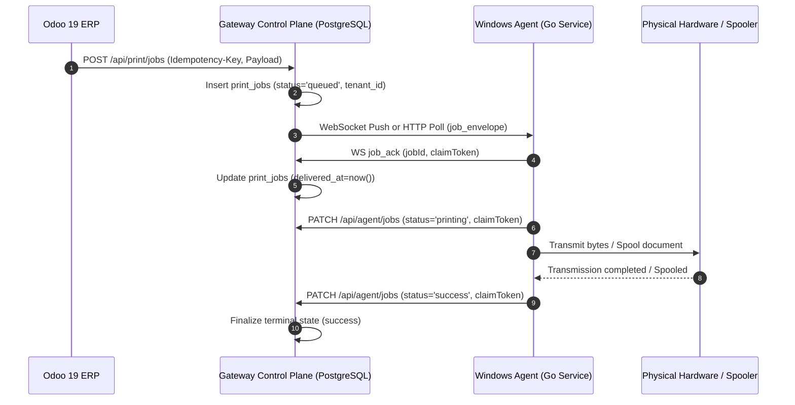

# Printing Architecture & Physical Execution Model

> **System Context**: Yasser Cloud Printing Platform — Distributed Printing Subsystem  
> **Target Environment**: Windows Service Agent, Edge POS/Label/Receipt/Office Printers, Next.js Control Plane  
> **Related Documents**: [ARCHITECTURE.md](./ARCHITECTURE.md), [PRINTERS.md](./PRINTERS.md), [AGENT_ARCHITECTURE.md](./AGENT_ARCHITECTURE.md)

---

## 1. Physical Side-Effect Principle

Printing is a **distributed physical side-effect problem**. Unlike an idempotent database write or a transient HTTP RPC, a physical print job alters the external physical state (ink, paper, cutter, cash drawer).

### The Uncertainty Rule
A network partition or timeout that occurs after bytes are transmitted to a printer does **not** mean the document failed to print. The physical outcome is strictly categorized as:

```text
               ┌───────────────────────────────┐
               │    Physical Print Outcomes    │
               └───────────────┬───────────────┘
                               │
         ┌─────────────────────┼─────────────────────┐
         ▼                     ▼                     ▼
    ┌─────────┐           ┌─────────┐           ┌─────────┐
    │ SUCCESS │           │ FAILED  │           │ UNKNOWN │
    └─────────┘           └─────────┘           └─────────┘
 (Bytes confirmed       (Pre-dispatch/        (Socket written /
  at device socket/     spooler reject /      timeout / agent
  spooler queue)        offline before bytes) crash mid-stream)
```

**Absolute Invariant**: The system **never** performs automated blind retries after an `UNKNOWN` physical outcome. Re-printing an unknown outcome is reserved for explicit human confirmation or configured `reprint_after_crash` policy.

---

## 2. Orthogonality of Transport vs Protocol

The architecture enforces strict separation between **how bytes are delivered** (Transport) and **how bytes are formatted** (Protocol).

```text
┌────────────────────────────────────────────────────────┐
│                      TRANSPORTS                        │
├──────────────┬──────────────┬──────────┬───────────────┤
│ Network TCP  │ Win Spooler  │ USB / IP │ IPP / IPPS    │
│ (Raw Socket) │ (Win32 RPC)  │ (Direct) │ (HTTP Driver) │
└──────┬───────┴──────┬───────┴────┬─────┴───────┬───────┘
       │              │            │             │
       ▼              ▼            ▼             ▼
┌────────────────────────────────────────────────────────┐
│                       PROTOCOLS                        │
├──────────────┬──────────────┬──────────┬───────────────┤
│ ESC/POS      │ ZPL-II       │ TSPL     │ RAW / Text    │
│ (Receipts)   │ (Zebra)      │ (TSC)    │ (Generic)     │
└──────────────┴──────────────┴──────────┴───────────────┘
```

### Protocol & Capability Matrix

| Connection Type | Supported Protocols | Valid Payload Types | Typical Target |
| :--- | :--- | :--- | :--- |
| `network` | `raw`, `escpos`, `zpl`, `tspl` | `raw`, `escpos`, `image` (JPEG raster) | Network Thermal / Label Printers (Port 9100) |
| `spooler` | `spooler`, `raw`, `escpos`, `zpl` | `pdf`, `raw`, `escpos`, `image` | Windows Spooler Queues, Laser/Inkjet Drivers |
| `usb` | `escpos`, `zpl`, `tspl`, `raw` | `raw`, `escpos`, `image` | Direct USB Thermal / Label Printers |
| `ipp` / `ipps` | `ipp`, `ipps` | `pdf` | Modern Network Office Printers / CUPS (default Port 631) |

Printer destinations are canonicalized and validated at both control-plane and agent boundaries. Network printers use the private/link-local `config.ip` plus the protocol-approved port; a conflicting legacy `config.address` is rejected. IPP/IPPS URLs must resolve to an allowed private/link-local destination, and `ipp://` or `ipps://` without an explicit port defaults to 631.

---

## 3. Job Submission & Claim Fencing Lifecycle



### Claim Fencing Invariant
1. Every claim generates a cryptographically random `claimToken`.
2. Any subsequent status transition (`printing`, `success`, `failed`, `queued`) must present the active `claimToken`.
3. Claims are admitted only while both ceilings remain: at most 5 delivery hand-offs and 5 safe queue returns.
4. A proven pre-execution rejection refunds its delivery attempt but increments `retries`; failed or ambiguous hand-offs retain the delivery charge.
5. Only a stale claim with no `delivered_at` or `acked_at` evidence is automatically requeued after 90 seconds. Delivered-but-silent and stale-printing outcomes are terminal and require manual reconciliation.
6. A superseded attempt's `claimToken` is rejected with `409 Conflict / ErrStaleClaim`, preventing split-brain execution.

---

## 4. Odoo Payload Generation Pipelines

### 1. POS Receipt Pipeline (`pos_print_router.js`)
* **Trigger**: POS Checkout / Receipt Screen.
* **Rendering**: Canvas render via OWL `OrderReceipt` component → 2D Context background fill `#ffffff` → JPEG base64 (quality 0.65).
* **Delivery**: Dispatched to `pos.order.action_print_gateway_receipt` → Gateway Image Payload.

### 2. PDF Report Interception Pipeline (`ir_actions_report.py`, `report_download_override.py`, `report_interceptor.js`)
* **Trigger**: Print Invoice, Sales Order, Delivery Slip, Picking Operation.
* **Interception**: 3-layer fail-closed interception catches report execution before browser download.
* **Rendering**: Native Odoo QWeb PDF engine generates raw binary PDF stream.
* **Delivery**: Gateway PDF Payload (`type='pdf', encoding='base64'`).

### 3. Kitchen & Label Pipelines
* **Kitchen Tickets**: JPEG image rendering with per-printer category routing and operation IDs. The agent reads dimensions before full decode, rejecting either dimension above 16,384 pixels, more than 40,000,000 source pixels, or a projected ESC/POS raster above 32 MiB.
* **Barcodes & Shipping Labels**: Native ZPL-II or TSPL commands submitted with `type='raw'` and the matching `protocol`. Diagnostic page names are command-language sanitized (`^`/`~` for ZPL; quotes/backslashes for TSPL).

---

## 5. Diagnostic Test Page Generation

To prevent transport mismatches and uncaught UI exceptions (such as React #441), `buildTestPrintPayloadForPrinter` constructs test pages tailored to the printer's declared protocol:

* **`escpos`**: Formatted thermal ticket with cut command (`\x1b\x40... \x1d\x56\x01`).
* **`zpl`**: Label formatted with `^XA^FO50,50^A0N...^XZ`.
* **`tspl`**: Label formatted with `SIZE 75 mm, 50 mm... PRINT 1,1`.
* **`raw`**: Plaintext ASCII banner test.
* **`spooler` / `ipp` / `ipps`**: Programmatically generated valid PDF 1.4 document containing text streams (`%PDF-1.4...`).
* **Unsupported / Unknown**: Structured `422 Unprocessable Entity` with `code: "CAPABILITY_MISMATCH"`, gracefully rendered in UI toasts without exception propagation.
