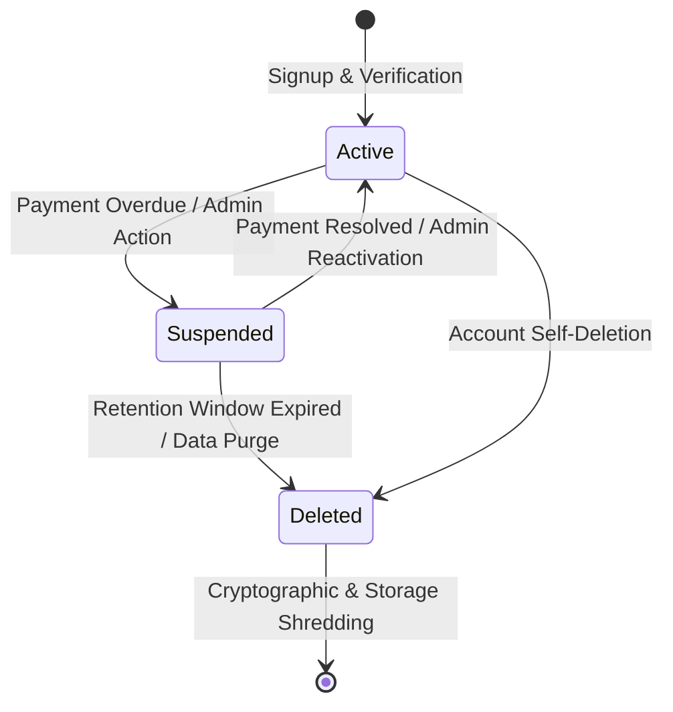

# Multi-Tenant Isolation & Security Invariants

> **System Context**: Odoo Print Gateway SaaS  
> **Applicable Standards**: AWS SaaS Tenant Isolation, PostgreSQL Composite Foreign Keys, Zero-Trust Application Boundaries  
> **Related Documents**: [ARCHITECTURE.md](./ARCHITECTURE.md), [MULTI_TENANCY.md](./MULTI_TENANCY.md), [SECURITY.md](./SECURITY.md)

---

## 1. Core Isolation Principle

The fundamental invariant of the SaaS control plane is:

$$\text{Authenticated} \ne \text{Authorized across Tenants}$$

Every request, database query, background job, WebSocket frame, and agent delivery attempt is strictly scoped to a single verified `tenant_id`. No operation is permitted to accept a caller-supplied tenant identifier without cryptographic or server-side authentication verifying ownership of that tenant context.

---

## 2. Multi-Layer Defense Matrix

| Layer | Enforcement Mechanism | Failure Mode / Handling |
| :--- | :--- | :--- |
| **Edge / Proxy** | `TRUST_PROXY_SECRET` header validation (≥32 chars, constant-time comparison). Rejects non-proxied or spoofed requests. | `400 Bad Request` |
| **Authentication** | Customer session JWT (Argon2id/scrypt), Agent token (`Bearer {agentId}:{secret}` SHA-256), Odoo API key (`Bearer {key}` SHA-256). | `401 Unauthorized` |
| **Tenant Guard** | `requireActiveTenant(tenantId)`: Evaluates tenant lifecycle (`active`, `suspended`, `deleted`). | `403 Forbidden` (`TENANT_SUSPENDED` / `TENANT_DELETED`) |
| **Application Layer** | Explicit `WHERE tenant_id = ?` on every Drizzle ORM query. Repositories accept `tenantId` from authenticated context only. | Zero rows returned / `404 Not Found` |
| **Database Relational** | Composite `UNIQUE(tenant_id, id)` and Composite Foreign Keys `(tenant_id, foreign_id) REFERENCES parent(tenant_id, id)`. | PostgreSQL `IntegrityError` (violates FK constraint) |
| **Data Plane / WebSocket** | WebSocket connection is authenticated during HTTP upgrade before protocol switch. In-flight maps partitioned by agent & tenant. | `401 Unauthorized` / WS Close `4401` |

---

## 3. Database Relational Isolation & Composite Foreign Keys

To prevent orphaned or cross-tenant foreign key references at the storage engine level, all child entities enforce composite referential integrity:

```sql
-- 1. Unique Constraints on Referenced Tables
ALTER TABLE "agents" ADD CONSTRAINT "agents_tenant_id_id_unique" UNIQUE ("tenant_id", "id");
ALTER TABLE "printers" ADD CONSTRAINT "printers_tenant_id_id_unique" UNIQUE ("tenant_id", "id");
ALTER TABLE "api_keys" ADD CONSTRAINT "api_keys_tenant_id_id_unique" UNIQUE ("tenant_id", "id");

-- 2. Composite Foreign Keys on Dependent Tables
ALTER TABLE "printers"
  ADD CONSTRAINT "printers_tenant_id_agent_id_agents_fk"
  FOREIGN KEY ("tenant_id", "agent_id")
  REFERENCES "agents" ("tenant_id", "id")
  ON DELETE CASCADE;

ALTER TABLE "print_jobs"
  ADD CONSTRAINT "print_jobs_tenant_id_printer_id_printers_fk"
  FOREIGN KEY ("tenant_id", "printer_id")
  REFERENCES "printers" ("tenant_id", "id")
  ON DELETE CASCADE;

ALTER TABLE "print_jobs"
  ADD CONSTRAINT "print_jobs_tenant_id_agent_id_agents_fk"
  FOREIGN KEY ("tenant_id", "agent_id")
  REFERENCES "agents" ("tenant_id", "id")
  ON DELETE CASCADE;
```

### Relational Invariant Guarantee
Even if an application-layer bug were to omit a `tenant_id` check in an `INSERT` or `UPDATE` statement, PostgreSQL will reject any transaction attempting to associate a Printer of Tenant A with an Agent of Tenant B, or create a Print Job referencing mismatched tenant components.

---

## 4. Tenant Lifecycle State Machine



### Runtime Behavior under Suspension & Deletion
1. **Agent Authentication**: When `agents.tenant_id` points to a `suspended` or `deleted` tenant, `validateAgent()` immediately rejects heartbeat, WebSocket upgrade, and poll requests.
2. **Odoo Print Submissions**: `POST /api/print/jobs` and `POST /api/odoo/*` invoke `requireActiveTenant()`, halting print queueing and returning `403 Forbidden`.
3. **Queue Draining**: In-flight jobs for a suspended tenant are gated by claim fencing and cannot be physically delivered.

---

## 5. Explicit Security Invariants & Automated Test Proofs

The repository enforces the following invariants via executable automated test suites in `tests/tenant-isolation.test.ts` and `tests/saas-control-plane-contract.test.ts`:

1. **Tenant Isolation Invariant 1 (Agent Read)**:
   * *Rule*: Tenant A Manager Session cannot view or list Agents belonging to Tenant B.
   * *Proof*: `GET /api/agents` filters by `session.tenantId`. Verified in `tests/tenant-isolation.test.ts`.

2. **Tenant Isolation Invariant 2 (Printer Read & Mutate)**:
   * *Rule*: Tenant A cannot read, update, or trigger test prints on Tenant B printers.
   * *Proof*: `GET /api/printers/[id]`, `PATCH /api/printers/[id]`, and `POST /api/printers/[id]/test-print` query `WHERE id = ? AND tenant_id = ?`. Returns `404 Not Found`.

3. **Tenant Isolation Invariant 3 (Job Claim & Delivery)**:
   * *Rule*: Agent A of Tenant A cannot claim or acknowledge Print Jobs submitted by Tenant B, even if the exact `job_id` is supplied in the request.
   * *Proof*: `POST /api/agent/jobs` and WebSocket dispatch verify `job.tenant_id == agent.tenant_id`.

4. **Tenant Isolation Invariant 4 (Cross-Tenant WebSocket Subscription)**:
   * *Rule*: Agent A cannot subscribe to PostgreSQL `LISTEN/NOTIFY` channels or WebSocket delivery streams of Tenant B.
   * *Proof*: WebSocket connection binds `agentId` and `tenantId` upon handshake; notifications are dispatched exclusively to matching sockets.

5. **Tenant Isolation Invariant 5 (Odoo API Key Scoping)**:
   * *Rule*: Odoo ERP instance configured with API Key for Tenant A cannot read printers, agents, or submit jobs for Tenant B.
   * *Proof*: `src/lib/odoo-auth.ts` resolves tenant directly from the hashed API key record in `api_keys`.

---

## 6. Future Isolation Roadmap (Pool → Bridge → Silo → Cells)

1. **Phase 1: Pool (Current)** — Shared database, shared schema, composite FKs, application-level `tenant_id` isolation.
2. **Phase 2: Pool + PostgreSQL RLS (Defense-in-Depth)** — Adding `CREATE POLICY tenant_isolation_policy ON ... USING (tenant_id = current_setting('app.current_tenant_id'))` to guard against developer query mistakes.
3. **Phase 3: Bridge (Schema-per-Tenant)** — For enterprise customers requiring logical PostgreSQL schema separation within shared database instances.
4. **Phase 4: Silo / Cells (Database-per-Tenant & Regional Stamps)** — Dedicated database instances or isolated compute cells for high-throughput enterprise tiers without changing domain models.
